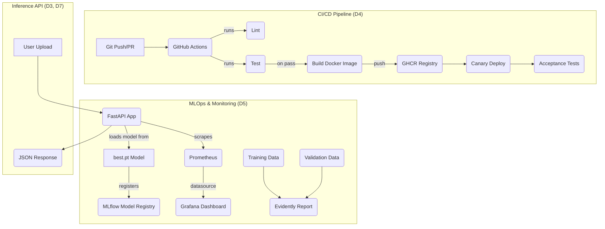

# Foodalyze
## Your pocket nutritionist, powered by AI.
A *YOLOv8-powered API* for detecting Indian food dishes and estimating their calorie content.

-----

## Architecture

This diagram shows the complete MLOps workflow — from model training to a monitored API endpoint.



## Dataset: [https://drive.google.com/file/d/1SOqkv7GBLbs\_f6AISFvczdh1rRS29\_AP/view?usp=sharing](https://drive.google.com/file/d/1SOqkv7GBLbs_f6AISFvczdh1rRS29_AP/view?usp=sharing)

## Quick Start

Get the API running locally in *two simple steps*.

### Clone the Repository

```bash
git clone https://github.com/alina1114/Foodalyze.git
cd Foodalyze
```

### Build and Run the App

This command installs dependencies, formats code, and starts the development server:

```bash
make dev
```

Then open:
👉 [http://localhost:8000/docs](https://www.google.com/search?q=http://localhost:8000/docs)

-----

## Makefile Commands

| Command | Description |
| :--- | :--- |
| make install | Creates a Python virtual environment and installs dependencies. |
| make dev | Starts the FastAPI server with live reload. |
| make lint | Runs lint checks (ruff, black). |
| make format | Auto-formats code. |
| make test | Runs tests with pytest. |
| make docker | Builds Docker image. |
| make run | Runs Docker container locally. |
| make monitor-up | Starts MLflow, Prometheus, Grafana. |
| make monitor-down | Stops monitoring stack. |

-----

## API Documentation (D7)

FastAPI automatically generates documentation:

  * *Swagger UI:* [http://localhost:8000/docs](https://www.google.com/search?q=http://localhost:8000/docs)
  * *ReDoc:* [http://localhost:8000/redoc](https://www.google.com/search?q=http://localhost:8000/redoc)

-----

### ✅ Health Check (GET /health)

Verifies API status and model load.

-----

### ✅ Predict Endpoint (POST /predict)

Upload an image → receive \*detections, \*\*bounding boxes, and \**calorie estimates*.

#### Example cURL

```bash
curl -X 'POST' \
  'http://localhost:8000/predict?conf=0.4' \
  -H 'accept: application/json' \
  -H 'Content-Type: multipart/form-data' \
  -F 'file=@/path/to/image.jpg'
```

#### Example Response

```json
{
  "image": "your_image.jpg",
  "num_detections": 1,
  "detections": [
    {
      "class_id": 12,
      "class_name": "chana_masala",
      "confidence": 0.9234,
      "bbox": {"x1": 150, "y1": 210, "x2": 450, "y2": 500},
      "portion_desc": "1 bowl",
      "portion_g": 240,
      "calories_estimate": 348
    }
  ],
  "timestamp": "2025-10-28T13:00:00.000000"
}
```

-----

## ML Workflow Monitoring (D5)

### ✅ MLflow (Model Registry)

Tracks and versions all trained YOLO models.

Tracking URI: file:///Users/bstar/Documents/Fall25/MLOps/MLFlow/mlruns

Experiment Name: *YOLOv8\_Indian\_Food\_Detection*
Registered Model: *Foodalyze\_YOLOv8\_Detector*

Trained for 30 epochs
Image size: 640×640

\

\

\

-----

### ✅ Evidently (Data Drift)

\
\

-----

### ✅ Prometheus + Grafana (API Metrics)

Prometheus scrapes live API metrics.
Grafana visualizes:

  * CPU usage
  * Memory usage
  * CPU temperature (simulated)

\
\
\

-----

## Tech Stack

  * *Backend:* FastAPI
  * *ML Framework:* PyTorch + YOLOv8
  * *Monitoring:* MLflow, Evidently, Prometheus, Grafana
  * *Containerization:* Docker & Docker Compose
  * *Cloud:* AWS EC2 + CloudWatch

-----

## ✅ Cloud Deployment (D9 Cloud Integration)

This project uses *two AWS cloud services*:

✅ *EC2* — hosts the inference API
✅ *CloudWatch* — monitors logs and system metrics

-----

## 1\. AWS Services Used

### ✅ 1.1 EC2 – Hosting the API

Runs Dockerized FastAPI YOLO inference server.

\

-----

### ✅ 1.2 CloudWatch – System Monitoring

Collects:

  * CPU utilization
  * Memory usage
  * Disk usage
  * Logs

-----

## 2\. Deployment Architecture

\

-----

## 3\. Reproducing the Setup

### ✅ 3.1 Launch EC2

1.  Ubuntu 22.04/24.04
2.  Open port *8000*

-----

### ✅ 3.2 Install Docker

```bash
sudo apt update
sudo apt install -y docker.io
sudo systemctl enable docker
sudo systemctl start docker
```

-----

### ✅ 3.3 Clone Repo

```bash
git clone https://github.com/<your-username>/<your-repo>.git
cd Foodalyze
```

-----

### ✅ 3.4 Build & Run Docker Container

```bash
sudo docker build -t foodalyze-api .
sudo docker run -d -p 8000:8000 foodalyze-api
sudo docker ps
```

-----

### ✅ 3.5 Access API

Open:
http://\<EC2-PUBLIC-IP\>:8000/docs

\

-----

### ✅ 3.6 Install & Configure CloudWatch Agent

```bash
# Download
wget https://s3.amazonaws.com/amazoncloudwatchagent/ubuntu/amd64/latest/amazon-cloudwatch-agent.deb

# Install
sudo dpkg -i amazon-cloudwatch-agent.deb

# Run config wizard
sudo /opt/aws/amazon-cloudwatch-agent/bin/amazon-cloudwatch-agent-config-wizard

# Start agent
sudo /opt/aws/amazon-cloudwatch-agent/bin/amazon-cloudwatch-agent-ctl \
    -a fetch-config -m ec2 \
    -c file:/opt/aws/amazon-cloudwatch-agent/bin/config.json -s

# Check status
sudo /opt/aws/amazon-cloudwatch-agent/bin/amazon-cloudwatch-agent-ctl -m ec2 -a status
```

\

\

-----

## ✅ 4. ML Workflow Interaction With Cloud Services

### ✅ 4.1 Model Storage

The YOLO model (best.pt) is stored and loaded from inside the Docker container.

-----

### ✅ 4.2 Inference on EC2

1.  User uploads image
2.  FastAPI decodes using cv2
3.  YOLO model performs detection
4.  Calories added using lookup
5.  JSON returned

-----

## Note: Docker compose isnt complete (bonus path)

## License

This project is licensed under the *MIT License*.
See the [LICENSE](https://www.google.com/search?q=LICENSE) file for more details.

-----
