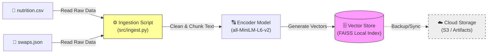

# 🍛 Healthy Indian Food AI (LLMOps Milestone 2)

## Project Overview
This is a RAG (Retrieval-Augmented Generation) system that acts as an AI Nutritionist for Indian Cuisine. 
It uses **DeepSeek-7B** (or Phi-3) to answer questions based on a curated dataset of nutrition facts and healthy swaps.

## 📂 Structure
- `src/`: Source code for the API (`app.py`), Ingestion (`ingest.py`), and Frontend (`ui.py`).
- `data/`: The dataset (`csv`, `json`) and evaluation data (`eval.jsonl`).
- `experiments/`: Prompt engineering reports and evaluation scripts (D1).
- `faiss_index/`: The pre-built Vector Database.

## 🚀 How to Run
1. **Install:** `make install`
2. **Run RAG API:** `make rag`
3. **Run Frontend:** `streamlit run src/ui.py`
# Foodalyze

## Your pocket nutritionist, powered by AI.
A dual-engine system: **YOLOv8** for food detection and **DeepSeek-LLM** for nutritional RAG analysis.

-----

## 🏗️ System Architecture

This project consists of two main pipelines: Computer Vision (CV) for detection and Large Language Models (LLM) for RAG-based Q&A.

### 1. Computer Vision & MLOps Pipeline (YOLOv8)
This diagram shows the complete MLOps workflow — from model training to a monitored API endpoint.

```mermaid
graph TD
    subgraph "MLOps & Monitoring (D5)"
        D[best.pt Model] -- registers --> M(MLflow Model Registry)
        E(FastAPI App) -- scrapes --> P(Prometheus)
        P -- datasource --> G(Grafana Dashboard)
        T(Training Data) --> EV(Evidently Report)
        V(Validation Data) --> EV
    end
  
    subgraph "CI/CD Pipeline (D4)"
        A[Git Push/PR] --> B(GitHub Actions)
        B -- runs --> L(Lint)
        B -- runs --> TST(Test)
        TST -- on pass --> BLD(Build Docker Image)
        BLD -- push --> R(GHCR Registry)
        R --> DPL(Canary Deploy)
        DPL --> AT(Acceptance Tests)
    end
  
    subgraph "Inference API (D3, D7)"
        U[User Upload] --> E
        E -- loads model from --> D
        E --> J(JSON Response)
    end
````

### 2\. LLM RAG Pipeline (Milestone 2)

This diagram illustrates the retrieval, augmentation, and generation flow for the AI Nutritionist chatbot.

```mermaid
graph TD
    %% Nodes
    User([👤 User])
    UI[🖥️ Frontend Streamlit App]
    API[⚙️ Backend API FastAPI]
    VDB[(🗄️ Vector DB FAISS Index)]
    LLM[🧠 LLM Model DeepSeek-7B-Chat]
    
    %% Flow
    User -->|"1. Asks: Is Samosa healthy?"| UI
    UI -->|"2. Sends JSON Request"| API
    
    subgraph "RAG Pipeline"
        API -->|"3. Query Embeddings"| VDB
        VDB -->|"4. Retrieve Context (Nutrition Data)"| API
        API -->|"5. Construct Prompt (Context + Query)"| LLM
        LLM -->|"6. Generate Answer"| API
    end
    
    API -->|"7. JSON Response"| UI
    UI -->|"8. Display Answer"| User

    %% Styling
    style VDB fill:#f9f,stroke:#333,stroke-width:2px
    style LLM fill:#bbf,stroke:#333,stroke-width:2px
    style API fill:#dfd,stroke:#333,stroke-width:2px
```


## Dataset

**Access the Dataset Here:** [Google Drive Link](https://drive.google.com/file/d/1SOqkv7GBLbs_f6AISFvczdh1rRS29_AP/view?usp=sharing)

```
```
### 3.Data Flow & Ingestion (Milestone 2)
How raw nutrition data is processed and stored for retrieval.


    

## Quick Start

Get the API running locally in *two simple steps*.

### Clone the Repository

```bash
git clone https://github.com/alina1114/Foodalyze.git
cd Foodalyze
```

### Build and Run the App

This command installs dependencies, formats code, and starts the development server:

```bash
make dev
```

Then open:
👉 [http://localhost:8000/docs](https://www.google.com/search?q=http://localhost:8000/docs)

-----

## Makefile Commands
## Note: Docker compose isnt complete (bonus path)

| Command | Description |
| :--- | :--- |
| make install | Creates a Python virtual environment and installs dependencies. |
| make dev | Starts the FastAPI server with live reload. |
| make lint | Runs lint checks (ruff, black). |
| make format | Auto-formats code. |
| make test | Runs tests with pytest. |
| make docker | Builds Docker image. |
| make run | Runs Docker container locally. |
| make monitor-up | Starts MLflow, Prometheus, Grafana. |
| make monitor-down | Stops monitoring stack. |

-----
🛡️ Guardrails & Safety (Milestone 2 - D3) 
We utilize a custom Policy Engine (src/guardrails.py) to enforce Responsible AI guidelines. This ensures the system remains safe, secure, and helpful.

Protection Layers
Input Validation (Security):

PII Filter: Blocks emails, phone numbers, SSNs, and credit card patterns to prevent data leakage.

Prompt Injection: Detects and blocks adversarial attacks like "Ignore previous instructions" or "System Override".

Output Moderation (Safety):

Toxicity Filter: Scans the generated response for harmful keywords (violence, hate speech) before showing it to the user.

✅ Verification Results
We performed an automated stress test against 12 different attack vectors (including PII leaks, DAN jailbreaks, and roleplay attacks).

🏆 Result: 12/12 Passed (100% Block Rate) All malicious attempts were successfully intercepted by the guardrail middleware layer (HTTP 400 Bad Request).


## API Documentation (D7)

FastAPI automatically generates documentation:

  * *Swagger UI:* [http://localhost:8000/docs](https://www.google.com/search?q=http://localhost:8000/docs)
  * *ReDoc:* [http://localhost:8000/redoc](https://www.google.com/search?q=http://localhost:8000/redoc)

-----

### ✅ Health Check (GET /health)

Verifies API status and model load.

-----

### ✅ Predict Endpoint (POST /predict)

Upload an image → receive \*detections, \*\*bounding boxes, and \**calorie estimates*.


#### Example cURL

```bash
curl -X 'POST' \
  'http://localhost:8000/predict?conf=0.4' \
  -H 'accept: application/json' \
  -H 'Content-Type: multipart/form-data' \
  -F 'file=@/path/to/image.jpg'
```

#### Example Response

```json
{
  "image": "your_image.jpg",
  "num_detections": 1,
  "detections": [
    {
      "class_id": 12,
      "class_name": "chana_masala",
      "confidence": 0.9234,
      "bbox": {"x1": 150, "y1": 210, "x2": 450, "y2": 500},
      "portion_desc": "1 bowl",
      "portion_g": 240,
      "calories_estimate": 348
    }
  ],
  "timestamp": "2025-10-28T13:00:00.000000"
}
```

-----

## ML Workflow Monitoring (D5)

### ✅ MLflow (Model Registry)

Tracked YOLO runs locally in Milestone 1 then moved the runs (only) to the server in Milestone 2.
Endpoint: 

Tracks and versions all trained YOLO models.

Tracking URI: file:///Users/bstar/Documents/Fall25/MLOps/MLFlow/mlruns

Experiment Name: *YOLOv8\_Indian\_Food\_Detection*
Registered Model: *Foodalyze\_YOLOv8\_Detector*

Trained for 30 epochs


-----

### ✅ Evidently (Data Drift)

YOLO Drift (Milestone 1):


\

### ✅ Evidently (Retrieval Corpus Drift)

The faiss index is static (indices can't be added incrementally so drift is 0)


-----

### ✅ Prometheus + Grafana (API Metrics) - Milestone 1

Link to Dashboards:
http://13.61.104.51:3000/dashboards


Prometheus scrapes live API metrics.
Grafana visualizes:

  * CPU usage
    

  * Memory usage

    

  * CPU temperature (simulated)
    

-----
## Prometheus + Grafana (API Metrics) - Milestone 2

##  *1. LLM Request Latency (P95)*

This graph shows the *95th percentile latency* of all LLM inference requests over time.

* Uses: histogram_quantile(0.95, rate(llm_request_duration_seconds_bucket[$__rate_interval]))
* Purpose: Tracks how long the slowest 5% of requests take.
* Interpretation:

  * Stable, low values indicate good LLM performance.
  * Spikes may mean CPU overload, large prompts, or model cold starts.


## *2. Guardrail Violations*

Displays the total count of *blocked or flagged responses* by the system’s safety guardrails.

* Metric: guardrail_violations_total
* Purpose: Measures how often the model produces unsafe/toxic/unsupported outputs.
* Interpretation:

  * A rising trend suggests more harmful inputs or weaker filters.
  * Helps verify safety systems are working correctly.
  


    
## 🔡 *3. LLM Token Usage*

Tracks total *input* and *output* tokens processed by the model over time.

* Metric: llm_token_usage_total{type="input"}
* Metric: llm_token_usage_total{type="output"}
* Purpose: Understand model load, cost, and usage patterns.
* Interpretation:

  * Growth in input tokens means larger user queries.
  * Growth in output tokens indicates longer/generated answers.
 
     

 

## 🖼️ *4. YOLO Prediction Count*

Shows how many YOLO detections were processed by the API.

* Metric: yolo_inference_duration_seconds_count
* Purpose: Monitor computer vision workload.
* Interpretation:

  * Spikes = increased image uploads.
  * Constant low activity means fewer classification requests.


## *5. YOLO Inference Latency (P95)*

Shows the *95th percentile latency* of YOLO detections.

* Uses: histogram_quantile(0.95, rate(yolo_inference_duration_seconds_bucket[$__rate_interval]))
* Purpose: Measure performance of image inference.
* Interpretation:

  * Usually low because YOLO is fast.
  * Spikes indicate CPU saturation or large images.


## Tech Stack

  * *Backend:* FastAPI
  * *ML Framework:* PyTorch + YOLOv8
  * *Monitoring:* MLflow, Evidently, Prometheus, Grafana
  * *Containerization:* Docker & Docker Compose
  * *Cloud:* AWS EC2 + CloudWatch

-----

## 
-----

## ☁️ Cloud Integration

For Milestone 2, we integrated **two AWS cloud services**:  
**Amazon EC2** for hosting the inference API and **Amazon S3** for storing model artifacts and FAISS indexes.  
CloudWatch was also used for monitoring API and system metrics.

---

### 🔹 **1. Amazon S3 — Artifact & Vector Store Storage**

We use S3 to store:

- `best.pt` (YOLO model weights)  
- `class_mapping.json`  
- `index.faiss` (RAG vector index)  
- `index.pkl` (metadata)

These artifacts are automatically loaded by the ingestion pipeline when deploying the RAG system.


---

### 🔹 **2. Amazon EC2 — Hosting the Foodalyze API**

The API (FastAPI + YOLOv8 + RAG) is deployed as a Docker container on AWS EC2.

- Public IP: `13.61.104.51`
- Open ports: 8000 (API), 3000 (Grafana), 8501 (UI)
- Deployed via Docker:
  `sudo docker run -d -p 8000:8000 foodalyze-api`


---

### 🔹 **3. Amazon CloudWatch — Monitoring the EC2 Instance**

CloudWatch tracks:

- CPU utilization (shows inference load)
- System-level metrics  
- Docker-level activity when CPU spikes occur during model inference


